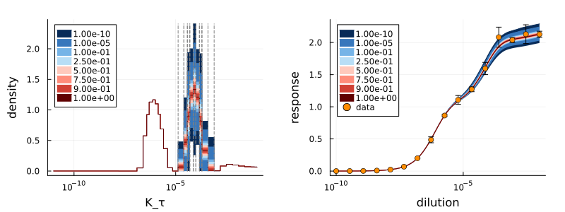

# AntibodyMethodsDoseResponseRecipes.jl

[](https://antibodypackages.github.io/AntibodyMethodsDoseResponse-documentation/)

A [Julia](https://julialang.org/) package with [`Plots.jl`](https://docs.juliaplots.org/stable/)-recipes for [`AntibodyMethodsDoseResponse.jl`](https://github.com/AntibodyPackages/AntibodyMethodsDoseResponse.jl).



## Installation

The package can be installed with the following commands

```julia
using Pkg
Pkg.Registry.add()
Pkg.Registry.add(RegistrySpec(url = "https://github.com/AntibodyPackages/AntibodyPackagesRegistry"))
Pkg.add("AntibodyMethodsDoseResponseRecipes")
```
Since the package is not part of the `General` registry the commands install the additional registry `AntibodyPackagesRegistry` first.

After the installation, the package can be used like any other package:
```julia
using AntibodyMethodsDoseResponseRecipes
```

## Resources

* **Documentation:** [https://antibodypackages.github.io/AntibodyMethodsDoseResponse-documentation/](https://antibodypackages.github.io/AntibodyMethodsDoseResponse-documentation/)
* **Corresponding paper:** [https://arxiv.org/abs/2407.06052](https://arxiv.org/abs/2407.06052)


